# TSITA GEST × BSCA Bank — Modèle conceptuel de données (MCD)

> Gestion des réclamations clients BSCA Bank. **Données 100 % fictives.**
> Schéma MySQL 8+ / InnoDB / utf8mb4, décrit à partir des migrations Laravel (source de vérité). Détail des colonnes : [`dictionnaire-donnees.md`](dictionnaire-donnees.md).

**Légende**

- `PK` clé primaire · `FK` clé étrangère · `UK` colonne unique (ou membre d'une contrainte d'unicité composite, précisée en commentaire).
- Cardinalités Mermaid (crow's foot) : `||` exactement un · `|o` zéro ou un · `|{` un ou plusieurs · `o{` zéro ou plusieurs. Le côté gauche d'une relation est la table référencée, le côté droit la table qui porte la FK.
- Une FK nullable se lit `|o--o{` (le dossier peut exister sans la référence) ; une FK obligatoire se lit `||--o{`.
- Toutes les FK sont en `ON DELETE RESTRICT`. Types simplifiés : `bigint` = BIGINT UNSIGNED, `bool` = TINYINT(1), `enum` = ENUM MySQL (valeurs dans le dictionnaire, §9).
- Seuls les attributs principaux figurent ; les horodatages `created_at` / `updated_at` sont omis sauf lorsqu'ils portent une règle.

```mermaid
erDiagram
    %% ---------- Référentiels ----------
    agencies {
        bigint id PK
        varchar code UK
        varchar name
        varchar city
        bool is_active
    }
    processing_entities {
        bigint id PK
        varchar code UK
        varchar name
        bool is_active
    }
    categories {
        bigint id PK
        varchar code UK
        varchar label
        int version
        bool is_active
    }
    products {
        bigint id PK
        varchar code UK
        varchar label
        bool is_active
    }
    channels {
        bigint id PK
        varchar code UK "portail agence telephone courriel courrier"
        varchar label
        bool is_active
    }
    settings {
        bigint id PK
        varchar key UK
        json value
    }

    %% ---------- Acteurs ----------
    customers {
        bigint id PK
        varchar full_name
        varchar email
        varchar phone
        text customer_number "chiffre"
        varchar address
        varchar preferred_channel "courriel courrier telephone"
    }
    users {
        bigint id PK
        varchar name
        varchar email UK
        varchar password "hache bcrypt"
        enum role
        bigint agency_id FK
        bigint entity_id FK
        bigint customer_id FK "role client"
        bool is_active
        text mfa_secret "chiffre"
        bool mfa_enabled
        smallint failed_logins
        timestamp locked_until
    }

    %% ---------- Paramétrage des délais et modèles ----------
    deadline_rules {
        bigint id PK
        varchar code UK "UK code + version"
        int version UK
        enum kind
        enum unit
        smallint duration
        enum source_type
        date effective_from
        date effective_to
        enum status
        bigint validated_by FK
    }
    holidays {
        bigint id PK
        date date UK "UK date + calendar_version + country"
        varchar calendar_version UK
        char country UK
        varchar label
    }
    response_templates {
        bigint id PK
        varchar code UK "UK code + version"
        int version UK
        enum kind
        varchar subject
        text body
        bool is_active
    }
    reference_sequences {
        smallint year PK
        int last_number
    }

    %% ---------- Cœur métier ----------
    complaints {
        bigint id PK
        varchar reference UK "TG-BSCA-AAAA-NNNNNN"
        varchar tracking_code_hash "bcrypt"
        bigint customer_id FK
        bigint channel_id FK
        bigint receiving_agency_id FK
        bigint processing_entity_id FK
        bigint category_id FK
        bigint product_id FK
        varchar subject
        text description
        enum status
        enum decision
        enum priority
        enum risk_level
        decimal amount "NULL si inconnu"
        char currency
        bool amount_flagged
        timestamp received_at
        timestamp acknowledged_at
        enum acknowledgment_status
        timestamp final_response_at
        timestamp closed_at
        bigint owner_id FK
        bigint deputy_id FK
        bigint parent_complaint_id FK "reouverture"
        bigint duplicate_of_id FK "doublon"
        varchar source_system UK "UK source_system + source_id"
        varchar source_id UK
        bigint created_by FK
    }
    complaint_events {
        bigint id PK
        bigint complaint_id FK
        enum type
        enum from_status
        enum to_status
        varchar title
        enum visibility
        bigint actor_id FK
        text reason
        timestamp created_at "append-only"
    }
    complaint_deadlines {
        bigint id PK
        bigint complaint_id FK "UK complaint_id + kind"
        bigint deadline_rule_id FK
        int rule_version
        enum kind UK
        enum unit
        timestamp due_at
        timestamp initial_due_at "jamais modifie"
        timestamp announced_at "date annoncee distincte"
        timestamp met_at
        enum status
    }
    attachments {
        bigint id PK
        bigint complaint_id FK
        bigint uploaded_by FK
        bool uploaded_by_client
        varchar original_name
        varchar stored_path "aleatoire fichier chiffre"
        varchar mime
        bigint size
        char sha256
        enum classification
        enum visibility
        enum scan_status
    }
    messages {
        bigint id PK
        bigint complaint_id FK
        enum kind
        enum direction
        bigint channel_id FK
        bigint author_id FK
        bool author_is_client
        text body
        enum delivery_status
        timestamp sent_at
        bigint template_id FK
    }
    tasks {
        bigint id PK
        bigint complaint_id FK
        varchar title
        bigint assignee_id FK
        timestamp due_at
        enum status
        timestamp completed_at
    }

    %% ---------- Solutions et qualité ----------
    solutions {
        bigint id PK
        bigint complaint_id FK "UK complaint_id + version"
        int version UK
        enum type
        text description
        decimal amount
        char currency
        enum decision
        enum status
        bool requires_n2
        bigint proposed_by FK
        timestamp submitted_at
    }
    approvals {
        bigint id PK
        bigint solution_id FK
        tinyint level "1 ou 2"
        bigint approver_id FK
        enum decision
        text comment
        timestamp decided_at
    }
    quality_controls {
        bigint id PK
        bigint complaint_id FK
        bigint controller_id FK
        enum result
        text findings
        timestamp controlled_at
    }
    quality_actions {
        bigint id PK
        varchar title
        text root_cause
        bigint category_id FK
        bigint owner_id FK
        bigint owner_entity_id FK
        timestamp due_at
        enum status
        timestamp completed_at
    }
    complaint_quality_action {
        bigint complaint_id PK, FK
        bigint quality_action_id PK, FK
    }

    %% ---------- Traçabilité, exports, validation, reprise ----------
    audit_logs {
        bigint id PK
        bigint user_id FK
        varchar action
        varchar auditable_type "polymorphe sans FK"
        bigint auditable_id
        json before
        json after
        text reason
        varchar ip
        timestamp created_at "append-only"
    }
    exports {
        bigint id PK
        bigint user_id FK
        varchar type
        enum format
        json filters
        date period_from
        date period_to
        timestamp as_of
        varchar rule_version
        int row_count
    }
    report_validations {
        bigint id PK
        varchar type
        date period_from
        date period_to
        json filters
        char filters_hash
        date as_of
        varchar rule_version
        json snapshot
        bigint validated_by FK
        timestamp validated_at
    }
    import_batches {
        bigint id PK
        varchar filename
        char file_sha256 UK "idempotence"
        varchar source_system
        enum status
        int rows_total
        int rows_created
        int rows_skipped
        int rows_anomalies
        json report
        bigint imported_by FK
    }
    import_anomalies {
        bigint id PK
        bigint import_batch_id FK
        int row_number
        varchar source_id
        varchar issue
        json raw
        enum resolution_status
        bigint resolved_by FK
    }

    %% ---------- Relations : acteurs et référentiels ----------
    agencies            |o--o{ users                    : "rattache"
    processing_entities |o--o{ users                    : "rattache"
    customers           |o--o{ users                    : "compte portail"

    customers           ||--o{ complaints               : "depose"
    channels            ||--o{ complaints               : "canal de reception"
    agencies            |o--o{ complaints               : "agence de reception"
    processing_entities |o--o{ complaints               : "entite de traitement"
    categories          |o--o{ complaints               : "nature"
    products            |o--o{ complaints               : "produit"
    users               |o--o{ complaints               : "proprietaire"
    users               |o--o{ complaints               : "suppleant"
    users               |o--o{ complaints               : "saisi par"
    complaints          |o--o{ complaints               : "parent (reouverture)"
    complaints          |o--o{ complaints               : "doublon de"

    %% ---------- Relations : dossier ----------
    complaints          ||--o{ complaint_events         : "chronologie"
    users               |o--o{ complaint_events         : "acteur"
    complaints          ||--o{ complaint_deadlines      : "echeances"
    deadline_rules      ||--o{ complaint_deadlines      : "regle appliquee"
    users               |o--o{ deadline_rules           : "valide"
    complaints          ||--o{ attachments              : "pieces jointes"
    users               |o--o{ attachments              : "depose"
    complaints          ||--o{ messages                 : "echanges"
    channels            |o--o{ messages                 : "canal"
    users               |o--o{ messages                 : "auteur"
    response_templates  |o--o{ messages                 : "modele"
    complaints          ||--o{ tasks                    : "taches"
    users               |o--o{ tasks                    : "assignee"

    %% ---------- Relations : solutions et qualité ----------
    complaints          ||--o{ solutions                : "versions de solution"
    users               ||--o{ solutions                : "propose"
    solutions           ||--o{ approvals                : "approbations N1 N2"
    users               ||--o{ approvals                : "approbateur"
    complaints          ||--o{ quality_controls         : "controles"
    users               ||--o{ quality_controls         : "controleur"
    categories          |o--o{ quality_actions          : "nature"
    users               |o--o{ quality_actions          : "pilote"
    processing_entities |o--o{ quality_actions          : "entite pilote"
    complaints          ||--o{ complaint_quality_action : "lie a"
    quality_actions     ||--o{ complaint_quality_action : "couvre"

    %% ---------- Relations : traçabilité ----------
    users               |o--o{ audit_logs               : "auteur"
    users               ||--o{ exports                  : "exporte"
    users               ||--o{ report_validations       : "valide"
    users               ||--o{ import_batches           : "importe"
    import_batches      ||--o{ import_anomalies         : "anomalies"
    users               |o--o{ import_anomalies         : "resout"
```

Tables techniques Laravel non représentées (sans valeur métier, sans FK déclarée) : `password_reset_tokens`, `sessions` (`user_id` indexé sans FK), `cache`, `cache_locks`, `jobs`, `job_batches`, `failed_jobs`, `personal_access_tokens` (propriétaire polymorphe `tokenable_type` / `tokenable_id`), `migrations`. Les entités `settings`, `holidays` et `reference_sequences` sont isolées : elles sont lues par les services (`Setting::get`, `DeadlineCalculator`, `ReferenceGenerator`) sans clé étrangère.

---

## Liste des relations

| # | Relation (référencée → porteuse de la FK) | Colonne FK | Cardinalité | Signification |
|---|---|---|---|---|
| 1 | `agencies` → `users` | `users.agency_id` (null) | 0..1 — 0..n | Agence de rattachement d'un agent. |
| 2 | `processing_entities` → `users` | `users.entity_id` (null) | 0..1 — 0..n | Entité de rattachement d'un gestionnaire / responsable. |
| 3 | `customers` → `users` | `users.customer_id` (null) | 0..1 — 0..n | Compte portail d'un client. |
| 4 | `customers` → `complaints` | `complaints.customer_id` | 1 — 0..n | Un client dépose des réclamations ; toute réclamation a un réclamant. |
| 5 | `channels` → `complaints` | `complaints.channel_id` | 1 — 0..n | Canal de réception obligatoire. |
| 6 | `agencies` → `complaints` | `complaints.receiving_agency_id` (null) | 0..1 — 0..n | Agence de réception. |
| 7 | `processing_entities` → `complaints` | `complaints.processing_entity_id` (null) | 0..1 — 0..n | Entité en charge du traitement. |
| 8 | `categories` → `complaints` | `complaints.category_id` (null) | 0..1 — 0..n | Nature, renseignée à la qualification. |
| 9 | `products` → `complaints` | `complaints.product_id` (null) | 0..1 — 0..n | Produit concerné. |
| 10 | `users` → `complaints` | `complaints.owner_id` (null) | 0..1 — 0..n | Propriétaire (gestionnaire affecté). |
| 11 | `users` → `complaints` | `complaints.deputy_id` (null) | 0..1 — 0..n | Suppléant. |
| 12 | `users` → `complaints` | `complaints.created_by` (null) | 0..1 — 0..n | Auteur de la saisie (NULL : dépôt client sans compte ou système). |
| 13 | `complaints` → `complaints` | `complaints.parent_complaint_id` (null) | 0..1 — 0..n | Réouverture / contestation : dossier enfant rattaché au dossier d'origine. |
| 14 | `complaints` → `complaints` | `complaints.duplicate_of_id` (null) | 0..1 — 0..n | Doublon rattaché au dossier principal. |
| 15 | `complaints` → `complaint_events` | `complaint_events.complaint_id` | 1 — 0..n | Chronologie du dossier. |
| 16 | `users` → `complaint_events` | `complaint_events.actor_id` (null) | 0..1 — 0..n | Acteur de l'événement. |
| 17 | `complaints` → `complaint_deadlines` | `complaint_deadlines.complaint_id` | 1 — 0..n (au plus une par `kind`) | Échéances du dossier. |
| 18 | `deadline_rules` → `complaint_deadlines` | `complaint_deadlines.deadline_rule_id` | 1 — 0..n | Règle (et version) ayant servi au calcul. |
| 19 | `users` → `deadline_rules` | `deadline_rules.validated_by` (null) | 0..1 — 0..n | Validateur conformité de la règle. |
| 20 | `complaints` → `attachments` | `attachments.complaint_id` | 1 — 0..n | Pièces jointes. |
| 21 | `users` → `attachments` | `attachments.uploaded_by` (null) | 0..1 — 0..n | Déposant interne. |
| 22 | `complaints` → `messages` | `messages.complaint_id` | 1 — 0..n | Messages et notes internes. |
| 23 | `channels` → `messages` | `messages.channel_id` (null) | 0..1 — 0..n | Canal du message. |
| 24 | `users` → `messages` | `messages.author_id` (null) | 0..1 — 0..n | Auteur interne. |
| 25 | `response_templates` → `messages` | `messages.template_id` (null) | 0..1 — 0..n | Modèle utilisé. |
| 26 | `complaints` → `tasks` | `tasks.complaint_id` | 1 — 0..n | Tâches du dossier. |
| 27 | `users` → `tasks` | `tasks.assignee_id` (null) | 0..1 — 0..n | Personne assignée. |
| 28 | `complaints` → `solutions` | `solutions.complaint_id` | 1 — 0..n (versions) | Solutions versionnées. |
| 29 | `users` → `solutions` | `solutions.proposed_by` | 1 — 0..n | Proposant. |
| 30 | `solutions` → `approvals` | `approvals.solution_id` | 1 — 0..n | Décisions N1 puis N2 éventuelle. |
| 31 | `users` → `approvals` | `approvals.approver_id` | 1 — 0..n | Approbateur. |
| 32 | `complaints` → `quality_controls` | `quality_controls.complaint_id` | 1 — 0..n | Contrôles qualité. |
| 33 | `users` → `quality_controls` | `quality_controls.controller_id` | 1 — 0..n | Contrôleur. |
| 34 | `categories` → `quality_actions` | `quality_actions.category_id` (null) | 0..1 — 0..n | Nature ciblée par l'action. |
| 35 | `users` → `quality_actions` | `quality_actions.owner_id` (null) | 0..1 — 0..n | Pilote. |
| 36 | `processing_entities` → `quality_actions` | `quality_actions.owner_entity_id` (null) | 0..1 — 0..n | Entité pilote. |
| 37 | `complaints` ↔ `quality_actions` | pivot `complaint_quality_action` | 0..n — 0..n | Une action corrective couvre plusieurs dossiers ; un dossier peut relever de plusieurs actions. |
| 38 | `users` → `audit_logs` | `audit_logs.user_id` (null) | 0..1 — 0..n | Auteur de l'action auditée. |
| 39 | `users` → `exports` | `exports.user_id` | 1 — 0..n | Auteur de l'export. |
| 40 | `users` → `report_validations` | `report_validations.validated_by` | 1 — 0..n | Validateur conformité du rapport. |
| 41 | `users` → `import_batches` | `import_batches.imported_by` | 1 — 0..n | Opérateur de la reprise. |
| 42 | `import_batches` → `import_anomalies` | `import_anomalies.import_batch_id` | 1 — 0..n | Anomalies du lot. |
| 43 | `users` → `import_anomalies` | `import_anomalies.resolved_by` (null) | 0..1 — 0..n | Personne ayant traité l'anomalie. |

Liens **logiques sans FK** : `audit_logs.auditable_type` + `auditable_id` → toute entité auditée (nom court de classe : `Complaint`, `Solution`, `ImportBatch`, `ReportValidation`…) ; `complaints.source_system` + `source_id` → ligne du fichier de reprise (et `import_batches.source_system`) ; `customers.preferred_channel` → code de `channels` ; `holidays.calendar_version` → `settings.holiday_calendar_version` ; `complaints.reference` → `reference_sequences.year` / `last_number`.

---

## Règles d'intégrité

**Intégrité référentielle**

- Toutes les FK sont `ON DELETE RESTRICT` / `ON UPDATE NO ACTION` : aucune suppression en cascade. Un référentiel, un utilisateur ou un client lié à un dossier ne peut pas être supprimé ; il est désactivé (`is_active = 0`) lorsque la table le prévoit.
- Aucune table ne pratique la suppression logique (soft delete) : les dossiers, solutions, messages et échéances sont conservés.

**Unicité et idempotence**

- `complaints.reference` unique, générée `TG-BSCA-AAAA-NNNNNN` à partir de `reference_sequences` (verrou `SELECT … FOR UPDATE` dans une transaction) : pas de collision en concurrence.
- `complaints (source_system, source_id)` unique et `import_batches.file_sha256` unique : une reprise rejouée ne crée ni lot ni dossier en double.
- `complaint_deadlines (complaint_id, kind)` : une seule échéance de chaque type par dossier.
- `solutions (complaint_id, version)` : versions de solution distinctes, jamais écrasées ; seule la dernière peut être soumise.
- `deadline_rules (code, version)`, `response_templates (code, version)`, `holidays (date, calendar_version, country)` : historisation par version.
- Codes uniques des référentiels (`agencies`, `processing_entities`, `categories`, `products`, `channels`), `users.email`, `settings.key`.

**Immutabilité et traçabilité**

- `complaint_events` et `audit_logs` sont **en ajout seul** : triggers MySQL `*_no_update` et `*_no_delete` (`SIGNAL SQLSTATE '45000'`), doublés d'un garde-fou Eloquent.
- `complaint_deadlines.initial_due_at` n'est jamais modifié ; un report communiqué au client est stocké dans `announced_at`, distinct de `due_at`. Les échéances ne sont pas suspendues pendant l'attente d'information.
- Chaque changement de statut passe par une transition autorisée (`ComplaintWorkflow`), exige un motif (hors transitions automatiques) et produit un `complaint_events` et un `audit_logs`.

**Réouverture et doublons**

- Réouverture = **nouveau dossier enfant** (`parent_complaint_id`), statut `reouvert`, nouvelle référence, nouveau code de suivi et nouvelles échéances ; le dossier d'origine et sa réponse restent inchangés. Elle n'est possible que sur un dossier répondu ou clôturé, non doublon, sans enfant encore ouvert.
- Doublon = marquage `duplicate_of_id` vers le dossier principal, sans suppression. Un dossier ne peut pas être son propre doublon ni pointer vers un dossier lui-même doublon.

**Valeurs et formats**

- Montant inconnu = `NULL`, jamais `0` ; tout montant renseigné est accompagné de `currency` (ISO 4217). `amount_flagged` est calculé (montant négatif ou ≥ seuil `amount_flag_threshold`). `requires_n2` est calculé (montant ≥ `n2_threshold`).
- Approbation : `approvals.level` vaut 1 puis 2 si `requires_n2` ; l'approbateur ne peut pas être le proposant ; un rejet exige un commentaire (règles applicatives, pas de contrainte CHECK).
- Reprise : aucune date de réponse n'est inventée (absente ou incohérente → `NULL` + `import_anomalies`) ; le libellé de statut source est conservé (`source_status_label`).
- Dates-heures stockées en UTC, affichées et calculées en Africa/Brazzaville.

**Sécurité des données**

- `users.password` et `complaints.tracking_code_hash` hachés (bcrypt) ; `users.mfa_secret` et `customers.customer_number` chiffrés (cast `encrypted`) ; pièces jointes chiffrées sur disque avec `stored_path` aléatoire et empreinte `sha256`.
